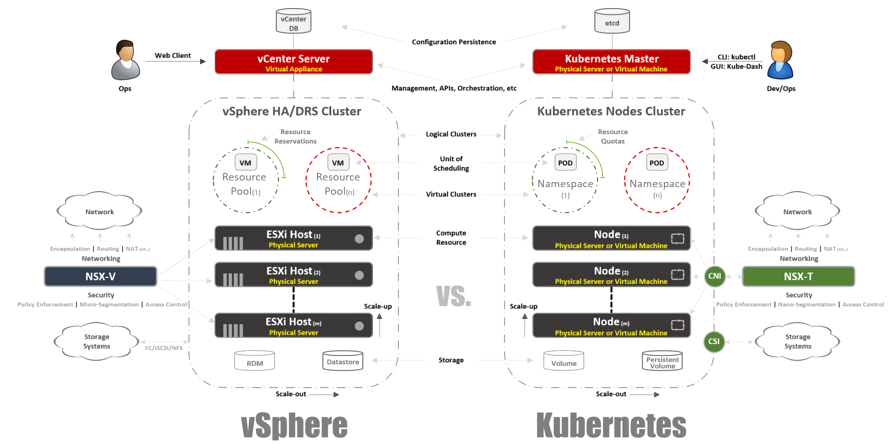

## README

本文翻译自 [Kubernetes Introduction for VMware Users – Part 1: The Theory]( https://blogs.vmware.com/cloudnative/2017/10/25/kubernetes-introduction-vmware-users/ )

By Hany Michaels, Senior Staff Solutions Architect NSBU, VMware

October 25, 2017

## 给 VMware 用户的 Kubernetes 简介–-第一部分：理论

This is the second part of my “Kubernetes in the Enterprise” blog series. As I mentioned in my [last article](http://www.hanymichaels.com/2017/10/04/kubernetes-in-the-enterprise-a-vmware-guide-on-how-to-design-deploy-and-operate-k8saas-with-nsx-t-and-vra/), it is important to get everyone to the same level of understanding about Kubernetes ([K8s](https://kubernetes.io/)) before we can proceed to the design and implementation guides.

> 这是我的“ kubernetes 在企业中应用” 博客系列的第二篇文章。正如我在上一篇文章提到的，重要的是要让每个人都相同级别的了解 在我们推进设计与实现指南

I am not going to take the traditional approach here to explain the Kubernetes architecture and technologies. I will explain everything through comparisons with the [vSphere platform](https://www.vmware.com/products/vsphere.html) that you, as a VMware user, are already familiar with. You can say that this was the approach I would have liked someone to use to introduce K8s to me. The latter could be very confusing and overwhelming to understand at the beginning. I’d like to add also that I used this approach internally at VMware to introduce Kubernetes to some audiences from different practices, and it has proven to work great and get people up to speed with the core concepts.

> 在这里，我不打算采用传统的方法来解释Kubernetes体系结构和技术。我将通过与vSphere平台的比较来解释您作为VMware用户已经熟悉的所有内容。你可以说，这就是我希望别人向我介绍k8的方法。后者在一开始可能会让人感到非常困惑和难以理解。我还想补充一点，我在VMware内部使用这种方法向来自不同实践的一些听众介绍Kubernetes

An important note before we kick this off: I am not using this comparison for the sake of it, or to prove any similarities or differences between vSphere and Kubernetes. Both are distributed systems at heart, and they must have similarities like any other similar system out there. What I am trying to achieve here at the end of the day is to introduce an incredible technology like Kubernetes to the broader VMware community.

> 在我们开始这个之前，有一个重要提示：我并不是为了这个比较，也不是为了证明vSphere和Kubernetes之间的任何异同。两者都是分布式系统的核心，它们必须有类似的系统有相似之处。最后，我试图在这里实现的是向更广泛的 VMware 社区介绍像 Kubernetes 这样的令人难以置信的技术。

Figure: The Kubernetes overall architecture compared to vSphere

## A little bit of history

You should already be familiar with containers before reading this post. I am not going to go through those basics as I am sure there are so many resources out there that talk about this. What I see very often though when I speak with my customers is that they cannot make much sense of why containers have taken our industry by storm and become very popular in record time. To answer this question, and in fact set the context for what is coming, I may have to tell you a little bit about my history as a practical example of how I personally made sense of all the shift that is happening in our industry.

> 在阅读这篇文章之前，您应该已经熟悉容器了。我不会通过这些基本知识，因为我相信有这么多的资源在那里谈论这一点。不过，当我与客户交谈时，我经常看到，他们无法理解为什么集装箱会让我们的行业遭受风暴袭击，并在创纪录的时间内非常受欢迎。为了回答这个问题，并实际上为即将到来的情况设定了背景，我可能必须告诉你一些关于我的历史，作为我个人如何理解我们行业正在发生的所有转变的一个实际例子

I used to be a web developer back in 2003 before I got introduced to the telecom world, and it was my second paying job after being a network engineer/admin. (I know, I was a jack-of-all-trades back then). I used to code in PHP, and I’ve done all sorts of applications from small internal apps used by my employer, to professional voting apps for TV programs, to telco apps interfacing with VSAT hubs and interacting with satellite systems. Life was great, except for one major hurdle that I am sure every developer can relate to: the dependencies.

> 早在2003年，我才成为网络开发人员，后来我被引入电信世界，这是我在成为网络工程师/管理员之后的第二份付费工作。（我知道，那时我是个万无一不的行业）。我过去使用PHP编写代码，我做过各种各样的应用程序，从我的雇主使用的小型内部应用程序，到电视节目的专业投票应用程序，到与VSAT中心接口的电信应用程序，以及与卫星系统交互。生活是伟大的，除了一个主要的障碍，我相信每个开发人员可以涉及到：依赖。

I first code my app on my laptop using something like the LAMP stack, and when it works well, I upload the source code to the servers, be it hosted out on the internet (anyone remember RackShack?) or on private servers for our end-customers. As you can imagine, as soon as I do that, my app is broken and it just won’t work on those servers. The reason, of course, is that the dependencies I use (like Apache, PHP, MySQL, etc.) have different releases than what I used on my laptop. So I have to figure out a way to either upgrade those releases on the remote servers (bad idea) or just re-code what I did on my laptop to match the remote stacks (worse idea). It was a nightmare, and sometimes I hated myself and questioned why I’m doing this for a living.

> 我首先在我的笔记本电脑上用LAMP堆栈之类的东西编写我的应用程序，当它工作正常时，我上传源代码到服务器，无论是托管在互联网上（谁还记得RackShack？可以想象，只要我这样做，我的应用程序是破碎的，它只是不会在这些服务器上工作。当然，原因是我使用的依赖项（如 Apache、PHP、MySQL 等）的版本与我在笔记本电脑上使用的版本不同。因此，我必须想办法升级远程服务器上的这些版本（坏主意），或者只是重新编写我在笔记本电脑上所做的代码，以匹配远程堆栈（更坏的想法）。那是一场噩梦，有时我恨自己，质疑我为什么要这么做。

Fast forward 10 years, and along came a company called Docker. I was a VMware consultant in professional services (2013) when I heard about Docker, and let me tell you that I couldn’t make any sense of that technology back in those days. I kept saying things like: “Why would I run containers when I can do that with VMs?” “Why would I give up important features like vSphere HA, DRS or vMotion for those weird benefits of booting up a container instantly or skipping the “hypervisor” layer?” In short, I was looking at this from a pure infrastructure perspective.

> 快进10年，并伴随着一个叫Docker的公司。当我听说 Docker 时，我是一名 VMware 专业服务顾问（2013 年），让我告诉你，在那些日子里，我无法理解该技术。我一直在说："为什么当我能够使用 VM 时运行容器？"我为什么要放弃重要功能，如 vSphere HA、DRS 或 vMotion，以立即启动容器或跳过"虚拟机管理程序"层？简而言之，我是从纯粹的基础架构的角度来看待这个问题的。

But then I started looking closer until it just hit me. Everything Docker is all about relates to developers. Only when I started thinking like one did it click. What if I had this technology back in 2003 and packaged my dependencies? My web apps would work no matter what server they run on. Better yet, I don’t have to keep uploading source code or setting up anything special. I can just “package” my app in an image and tell my customer to download that image and run it. That’s a web developer’s dream!

> 但后来我开始寻找更近，直到它刚刚击中我。Docker 的所有内容都与开发人员有关。只有当我开始像一个人一样思考时，它才点击。如果我在 2003 年拥有此技术并打包了依赖关系，该怎么办？无论在什么服务器上运行，我的 Web 应用都会工作。更好的是，我不需要继续上传源代码或设置任何特别的东西。我可以在图像中"打包"我的应用程序，并告诉我的客户下载该图像并运行它。这是一个网络开发人员的梦想！

Docker solved a huge issue for interop and packaging, but now what? As an enterprise customer, how can I operate this app at scale? I still want my HA, my DRS, my vMotion and my DR. It solved my developer problems and it created a whole bunch of new ones for my DevOps team. They need a platform to run those containers the same way they used to run VMs.

> Docker 解决了互操作和包装的一个大问题，但现在怎么办？作为企业客户，我如何大规模操作此应用程序？我仍然想要我的 HA、我的 DRS、我的 vMotion 和我的 DR。它解决了我的开发人员问题，并为我的 DevOps 团队创建了一大堆新的问题。他们需要一个平台来运行这些容器，就像他们用来运行 VM 一样。

But then along came Google to tell the world that it has been actually running containers for years (and in fact invented them – Google: cgroups), and that the proper way to do that is through a platform they called Kubernetes. They then open sourced it, gave it as gift to the community, and that changed everything again.

> 但随后，谷歌告诉世界，它实际上运行容器多年（事实上发明了它们 - 谷歌：c组），而这样做的正确方法是通过一个平台，他们称为Kubernetes。然后，他们打开来源，把它作为礼物送给社区，这再次改变了一切。

## Understanding Kubernetes by comparing it to vSphere

So what is Kubernetes? Simply put: it is to containers what vSphere was for VMs to make them data center ready. If you used to run VMware Workstation back in the early 2000s, you know that they were not seriously considered for running inside data centers. Kubernetes brings a way to run and operate containers in a production-ready manner. This is why we will start to compare vSphere side-by-side with Kubernetes in order to explain the details of this distributed system and get you up to speed on its features and technologies.

> 那么什么是库伯内特斯？简单地说：对于 VM 来说，vSphere 就是为 VM 准备好数据中心。如果您曾经在 21 世纪初运行 VMware 工作站，您知道在数据中心内运行时没有认真考虑过这些工作站。Kubernetes 带来了一种以生产就绪的方式运行和操作容器的方法。这就是为什么我们将开始将 vSphere 与 Kubernetes 并排进行比较，以便解释此分布式系统的详细信息，并让您快速了解其功能和技术。

Figure: The VM evolution from Workstation to vSphere compared to the current evolution for containers to Kubernetes

## System Overview

Just like vSphere’s vCenter and ESXi hosts, Kuberentes has the concept of master and nodes. In this context, the K8s master is equivalent to vCenter in that it is the management plane of the distributed system. It is also the APIs’ entry point where you interact with your workloads management. Similarly, the K8s nodes act as the compute resources like ESXi hosts. This is where you run your actual workloads (in K8s’ case we call them pods). The nodes could be virtual machines or physical servers. In vSphere’s case, of course, the ESXi hosts have to be physical always.

> 与 vSphere 的 vCenter 和 ESXi 主机一样，库贝伦特斯具有主节点和节点的概念。在此上下文中，K8s 主控形状等效于 vCenter，因为它是分布式系统的管理平面。它也是 API 的入口点，您可以在其中与工作负载管理进行交互。同样，K8s 节点充当像 ESXi 主机一样的计算资源。这是您运行实际工作负载的位置（在 K8s 的案例中，我们称之为 Pod）。节点可以是虚拟机或物理服务器。当然，在 vSphere 的情况下，ESXi 主机必须始终是物理的。

You can see also that K8s has a key-value store called “etcd.” It is similar to vCenter Server DB in that you store the cluster configuration as the desired state you want to adhere to there.

> 您还可以看到 K8s 具有名为"etcd"的键值存储。它类似于 vCenter 服务器 DB，因为您将群集配置存储为要遵守所需的状态。

On the differences side, K8s master can also run workloads, but vCenter cannot. The latter is just a virtual appliance dedicated to management. In K8s master case, it’s still considered a compute resource, but it’s not a good idea to run enterprise apps on it. Only system related apps would be fine.

> 在差异方面，K8s master 也可以运行工作负载，但 vCenter 不能运行。后者只是专用于管理的虚拟设备。在 K8s 主案例中，它仍然被视为计算资源，但运行企业应用不是个好主意。只有系统相关的应用程序将是好的。

So, how does this look in the real world? You will mainly use CLI to interact with this system (GUI is also a viable option). In the screenshot below, you can see that I am using a Windows machine to connect to my Kubernetes cluster via command like (I am using cmder in case you are wondering). We see in the screenshot that I have one master and 4 x nodes. They run K8s v1.6.5, and the nodes operating system is Ubuntu 16.04. At the time of this writing, we are mainly living in a Linux world where your master and nodes are always based on Linux distributions.

> 那么，在现实世界中，情况如何呢？您将主要使用 CLI 与此系统进行交互（GUI 也是一个可行的选项）。在下面的屏幕截图中，您可以看到我使用 Windows 计算机通过类似命令（如果您想知道的情况下使用 cmder）连接到我的 Kubernetes 群集。我们在屏幕截图中看到，我有一个主节点和 4 个 x 节点。它们运行 K8s v1.6.5，节点操作系统为 Ubuntu 16.04。在撰写本文时，我们主要生活在 Linux 世界中，您的主节点和节点始终基于 Linux 发行版。

## Workloads Form-factor

In vSphere, a virtual machine is the logical boundary of an operating system. In Kubernetes, pods are the boundaries for containers. Just like an ESXi host that can run multiple VMs, a K8s node can run multiple pods. Each Pod gets a routed IP address just like VMs to communicate with other pods.

> 在 vSphere 中，虚拟机是操作系统的逻辑边界。在库伯内特斯，吊舱是容器的边界。与可以运行多个 VM 的 ESXi 主机一样，K8s 节点可以运行多个 Pod。每个 Pod 获取路由 IP 地址，就像 VM 一样与其他 Pod 通信。

In vSphere, applications run inside OS. In Kubernetes, applications run inside containers. A VM can run one single OS, while a Pod can run multiple containers.

> 在 vSphere 中，应用程序在操作系统内运行。在 Kubernetes 中，应用程序在容器内运行。VM 可以运行单个操作系统，而 Pod 可以运行多个容器。

This is how you can list the pods inside a K8s cluster using the kubectl tool from the CLI. You can check the health of the pods, the age, the IP addresses and the nodes they are currently running inside.

> 这是使用 CLI 中的 kubectl 工具列出 K8s 群集中的 Pod 的方式。您可以检查 Pod 的运行状况、年龄、IP 地址以及它们当前在其中运行的节点。

## Management

So how do we manage our master, nodes and pods? In vSphere, we use the Web Client to manage most (if not all) the components in our virtual infrastructure. This is almost the same with Kubernetes with the use of the Dashboard. It is a nice GUI-based web portal where you can access your browser similarly to  Web Client. We’ve also seen in the previous sections that you can manage your K8s cluster using the kubeclt command from the CLI. It’s always debatable where you will spend most of your time — the CLI or the Dashboard, especially because the latter is becoming more powerful every day (check [this video](https://www.youtube.com/watch?v=3lhf7T9Bp2E) for more details). I personally find the Dashboard very convenient for quickly monitoring the health or showing the details of the various K8s components rather than typing long commands. It’s a preference, and you will find the balance between them naturally.

> 那么，我们如何管理主机、节点和 Pod？在 vSphere 中，我们使用 Web 客户端来管理虚拟基础架构中的大多数（如果不是全部）组件。这与使用仪表板的 Kubernetes 几乎相同。这是一个不错的基于 GUI 的 Web 门户，您可以在其中访问浏览器，类似于 Web 客户端。我们在前几节中还看到，您可以使用 CLI 中的 kubeclt 命令管理 K8s 群集。你总是在大部分时间里花在哪里——CLI或仪表板，特别是因为后者每天都在变得更强大（请查看[此视频]（https：//www.youtube.com/watch？v_3lhf7T9Bp2E），了解更多详情）。我个人认为仪表板非常方便，可以快速监视运行状况或显示各种 K8s 组件的详细信息，而不是键入长命令。这是一个偏好，你会发现他们之间的平衡自然。

## Configurations

One of the very profound concepts in Kubernetes is the desired state of configurations. You declare what you want for almost any Kubernetes component through a YAML file, and you create that using your kubectl (or through dashboard) as your desired state. Kubernetes will always strive from this moment on to keep that as a running state in your environment. For example, if you want to have four replicas of one pod, K8s will keep monitoring those pods. If one dies or the nodes it’s running have issues, it will self-heal and automatically create that pod somewhere else.

> Kubernetes 中非常深刻的概念之一是所需的配置状态。通过 YAML 文件声明几乎任何 Kubernetes 组件所需的内容，并使用库布（或通过仪表板）创建该组件作为所需状态。Kubernetes 将始终努力从这一刻起，保持它作为运行状态，在你的环境中。例如，如果要有一个窗格的四个副本，K8 将继续监视这些窗格。如果一个人死亡或它正在运行的节点有问题，它将自我修复，并自动创建该窗格在其他地方。

Back to our YAML configuration files — you can think of them like a .VMX file for a VM, or a .OVF descriptor for a virtual appliance that you want to deploy in vSphere. Those files define the configuration of the workload/component you want to run. Unlike VMX/OVF files that are exclusive to VMs/Appliances, the YAML configuration files are used to define any K8s component like ReplicaSets, Services, Deployments, etc. as we will see in the coming sections.

> 回到我们的 YAML 配置文件 - 您可以将它们想象成 一个 。VM 或 的 VMX 文件。要在 vSphere 中部署的虚拟设备的 OVF 描述符。这些文件定义要运行的工作负载/组件的配置。与 VMX/OVF 文件是 VM/设备独有的不同，YAML 配置文件用于定义任何 K8s 组件，如副本集、服务、部署等，我们将在下一节中看到。

## Virtual Clusters

In vSphere, we have physical ESXi hosts grouped logically to form clusters. We can slice those clusters into other virtual clusters called “Resource Pools.” Those resource pools are mostly used for capping resources. In Kubernetes, we have something very similar. We call them “namespaces,” and they could also be used to ensure resource quotas as we will see in the next section. They are most commonly used, however, as a means of multi-tenancy across applications (or users if you are using shared K8s clusters). This is also one of the ways  we can perform security segmentation with NSX-T across those namespaces as we will see in future posts.

> 在 vSphere 中，我们有物理 ESXi 主机逻辑分组以形成群集。我们可以将这些群集分割成其他虚拟群集，称为"资源池"。这些资源池主要用于限制资源。在库伯内特斯，我们有一些非常相似的东西。我们称它们为"命名空间"，它们还可用于确保资源配额，我们将在下一节中看到。但是，它们最常用作跨应用程序（或者使用共享 K8s 群集的用户）的多租户方法。这也是我们可以在这些命名空间使用 NSX-T 执行安全分段的方法之一，我们将在以后的帖子中看到。

## Resource Management

As I mentioned in the previous section, namespaces in Kubernetes are commonly used as a means of segmentation. The other use case for it is resource allocation, and it is referred to as “Resource Quotas.” As we saw in previous sections, the definition of that is through YAML configuration files where we declare the desirted state. In vSphere, we similarly define this from the Resource Pools settings as you see in the screenshot below.

> 正如我在上一节中提到的那样，Kubernetes 中的命名空间通常用作分段方法。它的另一个用例是资源分配，它被称为"资源配额"。正如我们在前面各节中所看到的，它的定义是通过 YAML 配置文件来声明期望状态的。在 vSphere 中，我们同样从资源池设置中定义这一点，如下图所示。

## Workloads Identification

This is fairly easy and almost identical between vSphere and Kubernetes. In the former, we use the concepts of tags to identify or group similar workloads, while in the latter we use the term “labels” to do this. In Kubernetes’ case, this is mandatory where we use things like “selectors” to identify our containers and apply the different configurations for them.

> 这是相当容易和几乎相同的vSphere和Kubernetes。在前者中，我们使用标记的概念来标识或分组类似的工作负载，而在后者中，我们使用术语"标签"来执行此操作。在 Kubernetes 的案例中，我们使用"选择器"之类的东西来识别我们的容器并为其应用不同的配置，这是强制性的。

## Redundancy

Now to the real fun. If you were/are a big fan of vSphere FT like me, you will love this feature in Kubernetes despite some differences in the two technologies. In vSphere, this is a VM with a running instance and a shadow one in a lock-step. We record the instructions from the running instance and replay it in the shadow VM. If the running instance goes down, the shadow VM kicks in immediately. vSphere then tries to find another ESXi host to bring another shadow instance to maintain the same redundancy. In Kubernetes, we have something very similar here. The ReplicaSets are a number you specify to run multiple instances of a pod. If one pod goes down, the other instances are available to serve the traffic. In the same time, K8s will try to bring up a substitute for that pod on any available node to maintain the desired state of the configuration. The major difference, as you may have already noticed, is that in the case of K8s, the pod instances are always live and service traffic. They are not shadowed workloads.

> 现在到真正的乐趣。如果你像我一样喜欢vSphere FT，你会喜欢这个功能在Kubernetes，尽管这两个技术有一些差异。在 vSphere 中，这是一个具有正在运行的实例的 VM，在锁步骤中具有影子实例。我们记录正在运行的实例中的指令，并在卷影 VM 中重播它。如果正在运行的实例出现故障，则卷影 VM 会立即启动。然后，vSphere 会尝试查找另一个 ESXi 主机，以引入另一个卷影实例以维护相同的冗余。在库伯内特斯，我们这里有一些非常相似的东西。副本集是您为运行一个窗格的多个实例而指定的数字。如果一个吊舱出现故障，则其他实例可用于为流量提供服务。同时，K8 将尝试在任何可用节点上为该吊舱提供一个替代项，以保持所需的配置状态。您可能已经注意到，主要区别是，在 K8s 的情况下，pod 实例始终是实时和服务流量。它们不是隐藏工作负载。

## Load Balancing

While this might not be a built-in feature in vSphere, it is still a common thing to run load-balancers on that platform. In the vSphere world, we have either virtual or physical load-balancers to distribute the network traffic across multiple VMs. This could be running in many different configuration modes, but let’s assume here that we are referring to the one-armed configuration. In this case, you are load-balancing your network traffic east-west to your VMs.

> 虽然这可能不是 vSphere 中的内置功能，但在该平台上运行负载均衡器仍是一个常见问题。在 vSphere 领域，我们有虚拟或物理负载均衡器，用于在多个 VM 之间分配网络流量。这可能在许多不同的配置模式下运行，但让我们在这里假设我们指的是单兵配置。在这种情况下，您将从东到西到 VM 的网络流量进行负载平衡。

Similarly in Kubernetes, we have the concepts of “Services.” A K8s Service could also be used in different configuration modes, but let’s pick the “ClusterIP” configuration here to compare to the one-armed LB. In this case, our K8s Service will have a virtual IP (VIP) that is always static and does not change. This VIP will distribute the traffic across multiple pods. This is especially important in the Kubernetes world were pods are ephemeral by nature and where you lose the pod IP address the moment it dies or gets deleted. So you have to always be able to maintain a static VIP.

> 同样，在库伯内特斯，我们有"服务"的概念。K8s 服务也可以在不同的配置模式下使用，但让我们在这里选择"ClusterIP"配置，以便与单臂 LB 进行比较。在这种情况下，我们的 K8s 服务将有一个始终静态且不会更改的虚拟 IP （VIP）。此 VIP 将在多个 Pod 上分配流量。这一点在Kubernetes世界尤其重要，因为吊舱本质上是短暂的，当你死或被删除的时候，你失去了吊舱IP地址。因此，您必须始终能够维护静态 VIP。

As I mentioned, the Services have many other configurations like “NodePort,” where you basically assign a port on the node level and then do a port-address-translation down to the pods. There is also the “LoadBalancer,” where you spin up an LB instance from a 3rd-party or a cloud provider.

> 正如我提到的，服务具有许多其他配置，如"NodePort"，其中您基本上在节点级别上分配一个端口，然后向下到 Pod 执行端口地址转换。还有"LoadBalancer"，从第三方或云提供商启动 LB 实例。

There is another very important load-balancing mechanism in Kuberentes called “Ingress Controller.” You can think of this like an in-line application load-balancer. The core concept behind this is that an ingress-controller (in a form of pod) would be spun up with an externally visible IP address, and that IP could have something like a wild card DNS record. When traffic hits an ingress-controller using the external IP, it will inspect the headers and determine through a set of rules you pre-define to which pod that hostname should belong. Example: _sphinx-v1_.esxcloud.net will be directed to the service “sphinx-svc-1”, while the _sphinx-v2_.esxcloud.net will be directed to the service “sphinx-svc2” and so on and so forth.

> 在库贝伦特斯中还有另一个非常重要的负载平衡机制，称为"入口控制器"。可以像在线应用程序负载平衡器一样考虑这一点。这背后的核心概念是，入口控制器（以 pod 的形式）将带有外部可见的 IP 地址，并且 IP 可以具有类似于通配符 DNS 记录的内容。当流量使用外部 IP 攻击入口控制器时，它将检查标头，并通过预先定义主机名应属于哪个 pod 的一组规则来确定该标头。示例：_sphinx-v1_.esxcloud.net 将定向到服务"sphinx-svc-1"，而_sphinx-v2_.esxcloud.net 将定向到服务"sphinx-svc2"等。

## Storage & Networking

Storage and networking are rich topics when it comes to Kubernetes. It is almost impossible to talk briefly about these two topics in an introduction blog post, but you can be sure that I will be blogging in details soon about the different concepts and options for each subject. For now, let’s quickly examine how the networking stack works in Kubernetes since we will have a dependency on it in a later section.

> 当涉及到Kubernetes时，存储和网络是丰富的主题。在介绍性博客文章中简要地谈论这两个主题几乎是不可能的，但你可以肯定，我将很快在博客上详细介绍每个主题的不同概念和选项。现在，让我们快速研究一下网络堆栈在 Kubernetes 中是如何工作的，因为我们将在后面的一节中依赖于它。

Kubernetes has different networking “plugins” that you can use to set up your nodes and pods network. One of the common plugins is “kubenet,” which is currently used on mega-clouds like Google Cloud Provider (GCP) and Amazon Web Services. I am going to talk briefly here about the GCP implementation and then show you a practical example later to examine this yourself on Google Container Engine (GKE).

> Kubernetes 具有不同的网络"插件"，您可以使用这些插件来设置节点和 Pod 网络。常见的插件之一是"kubenet"，它目前用于像谷歌云提供商（GCP）和亚马逊网络服务这样的巨型云。我将在这里简要地谈谈GCP实现，然后向您展示一个实际的例子，在谷歌容器引擎（GKE）上亲自研究一下。

This might be a bit too much to take in from a first glance, but hopefully you will be able to make sense of all that by the end of this blog post. First, we see that we have two Kubernetes nodes here: node 1 and node (m). Each node has an eth0 interface like any Linux machine, and that interface has an IP address to the external world—in our case here on subnet 10.140.0.0/24. The upstream L3 device is acting as our default gateway to route our traffic. This could be a L3 switch in your data center or a VPC router in a public cloud like GCP as we will see later. So far so good?

> 乍一看，这也许有点太过分了，但希望你能在博客文章的结尾理解这一切。首先，我们看到我们这里有两个 Kubernetes 节点：节点 1 和节点 （m）。每个节点都像任何 Linux 计算机一样具有 eth0 接口，并且该接口具有外部世界的 IP 地址 — 在子网 10.140.0.0/24 上。上游 L3 设备充当我们的默认网关，用于路由我们的流量。这可能是数据中心中的 L3 交换机，也可以是公共云中的 VPC 路由器（如 GCP），我们稍后将对此进行介绍。目前为止，一切都好？

Next, we see inside the node that we have a **cbr0** bridge interface. That interface has the default gateway of an IP subnet—10.40.1.0/24 in case of node 1. This subnet gets assigned by Kubernetes to each node. The latter usually get a /24 subnet, but you can control that in case of NSX-T as we will see in future posts. For now, this subnet is the one that we will allocate the pod’s IP addresses from. Any pod inside node 1 will get an IP address from this subnet rage—in our case here, Pod 1 has an IP address of 10.40.1.10. Notice however that this pod has two nested containers within. Remember, a pod can run one or more containers that are tightly coupled together in terms of functionality. This is what we see here. Container 1 is listening to port 80, while container 2 is listening to port 90. Both containers share the same IP address of 10.40.1.10. but they do not own that networking namespace. Alright, so who owns this networking stack then? It’s actually a special container that we call the “Pause Container.” You see it in the diagram as the interface of that pod to the outer world. It owns this networking stack, including the IP address 10.40.1.10 and, of course, it forwards the traffic to container 1 using port 80 and traffic to container 2 using port 90.

> 接下来，我们看到在节点内，我们有一个 [cbr0] 桥接接口。该接口具有 IP 子网的默认网关 —在节点 1 的情况下—：10.40.1.0/24。此子网由 Kubernetes 分配给每个节点。后者通常得到一个 /24 子网，但您可以控制在 NSX-T 的情况下，我们将在以后的帖子中看到。现在，此子网是我们将从中分配 Pod 的 IP 地址的子网。节点 1 内的任何 pod 都将从此子网愤怒中获得 IP 地址， 在我们的案例中，Pod 1 的 IP 地址为 10.40.1.10。但请注意，此窗格内有两个嵌套容器。请记住，pod 可以运行一个或多个在功能方面紧密耦合的容器。这就是我们在这里看到的。容器 1 侦听端口 80，而容器 2 侦听端口 90。两个容器共享相同的 IP 地址 10.40.1.10。但他们不拥有那个网络命名空间。好吧，那么谁拥有这个网络堆栈呢？它实际上是一个特殊容器，我们称之为"暂停容器"。在图中，您将其视为该窗格与外部世界的接口。它拥有此网络堆栈，包括 IP 地址 10.40.1.10，当然，它使用端口 80 将流量转发到容器 1，使用端口 90 将流量转发到容器 2。

Now you should be asking, how is traffic forwarded to the external world? You see that we have a standard Linux IP forwarding enabled here to forward the traffic from cbr0 to eth0. This is great, but then how does the L3 device know how to forward this to the destination? We do not have dynamic routing here to advertise this network in this particular example. And so, this is why we need to have some kind of “static route” on that L3 device to know that in order to reach subnet 10.40.1.0/24, your entry point is the external IP of node 1 (10.140.0.11), and in order to reach subnet 10.40.2.0/24, your next hope is node (m) with the IP address 10.140.0.12.

> 现在你应该问，流量是如何转发到外部世界的？你看，我们在此处启用了标准的 Linux IP 转发功能，将流量从 cbr0 转发到 eth0。这是伟大的，但然后L3设备如何知道如何转发到目的地？在此特定示例中，我们没有动态路由来通告此网络。因此，这就是为什么我们需要有某种"静态路由"在L3设备上知道，为了达到子网10.40.1.0/24，您的入口点是节点1（10.140.0.11）的外部IP，并为了达到子网10.40.2.0/24，您的下一个希望是节点 （m） 与 IP 地址 10.140.0.12。

This is great, but you must be thinking that it’s a very unpractical way to manage your networks. This would be an absolute nightmare for network administrators to maintain all those routes as you scale with your cluster. And you’re right—this is why we need some kind of solution like the CNI (container network plugin) in Kubernetes to use a networking mechanism to manage this for you. NSX-T is one of those solutions with a powerful design for both the networking and security stacks.

> 这是伟大的，但你一定认为，这是一个非常不实际的方式来管理您的网络。对于网络管理员来说，在与群集进行扩展时维护所有这些路由绝对是一场噩梦。你说得对，这就是为什么我们需要某种解决方案，如Kubernetes中的CNI（容器网络插件），以使用网络机制为您管理。NSX-T 是这些解决方案之一，具有强大的网络和安全堆栈设计。

Remember, we are examining here the kubernetes plugin, not CNI. The former is what GKE uses, and the way they do this is quite fascinating as it’s completely programmable and automated on their cloud. Those subnet allocations and associated routes are taken care of by GCP for you, as we will see in the next part.

> 请记住，我们正在审查这里的kubernetes插件，而不是CNI。前者是GKE使用，他们这样做的方式是相当迷人的，因为它是完全可编程和自动化的云。这些子网分配和相关路由由 GCP 为您负责，我们将在下一部分中看到。
